## 1. Fork repo

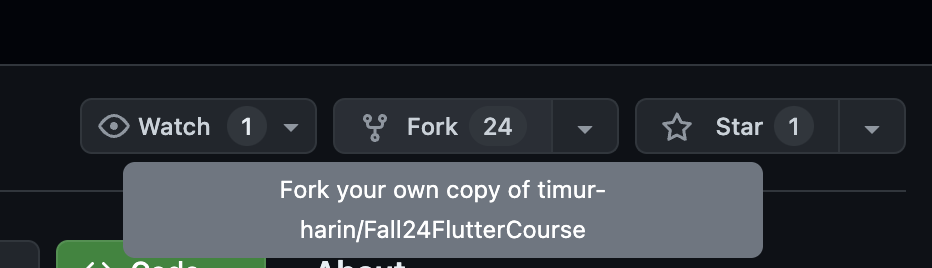

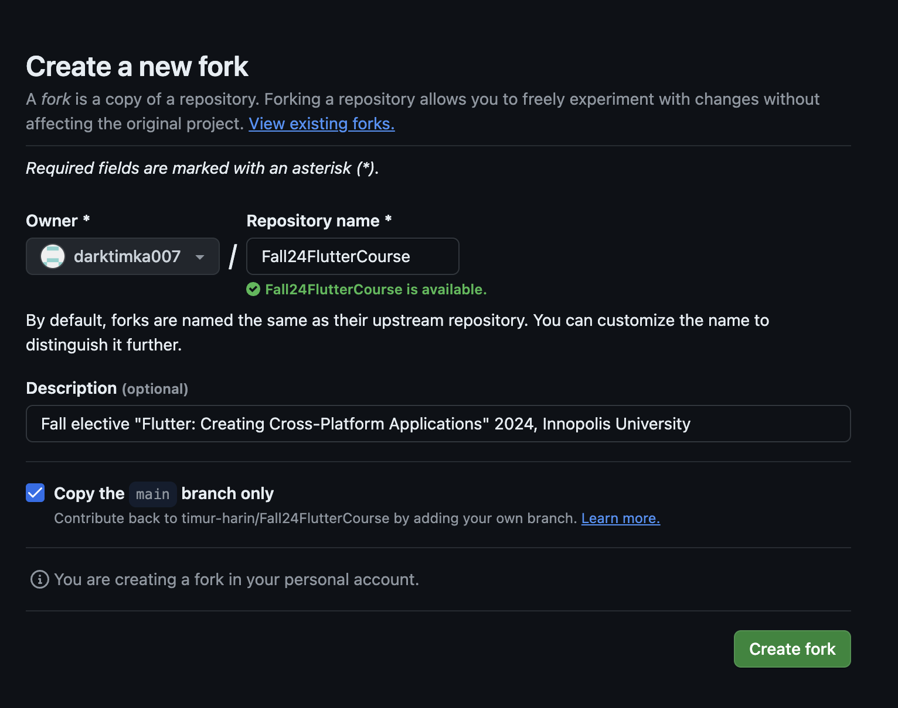

## 2. Check that it is up to date

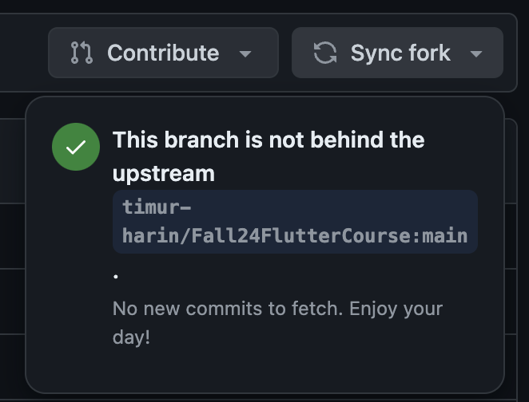

## 3. Clone repo

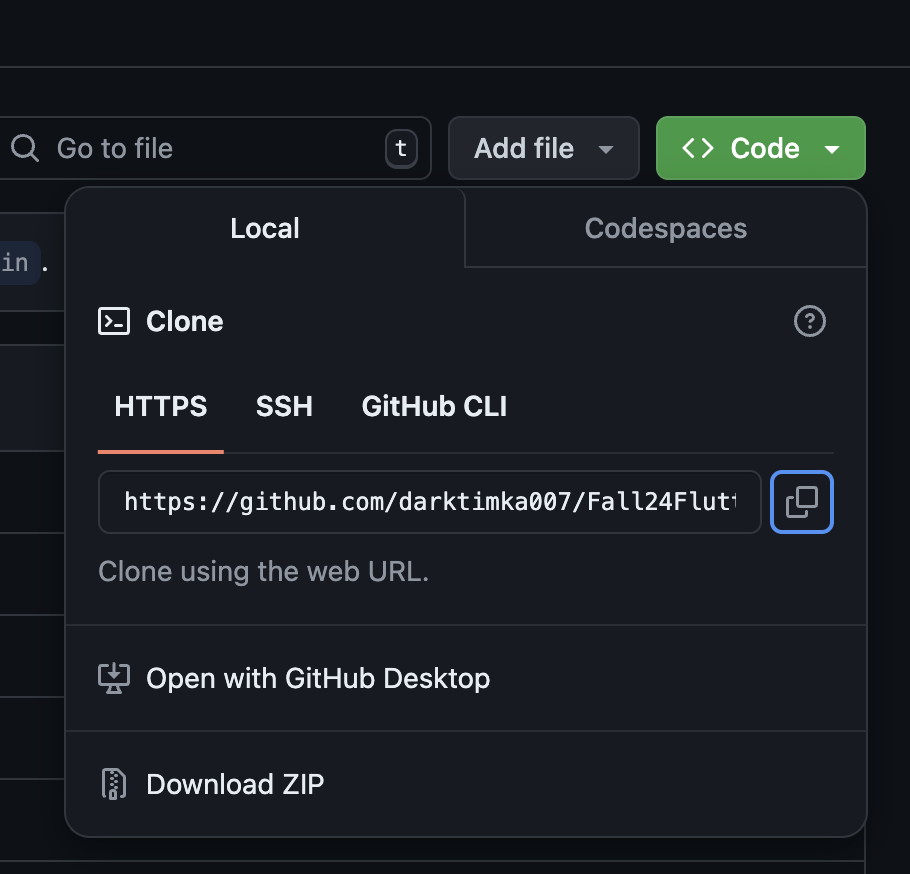

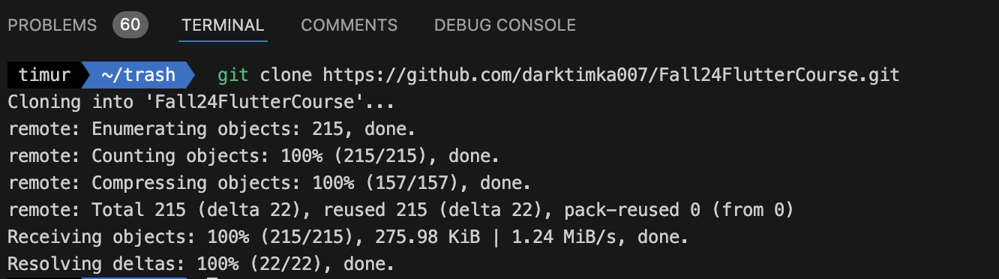

## 4. Check your branch

First you need to be on `main`

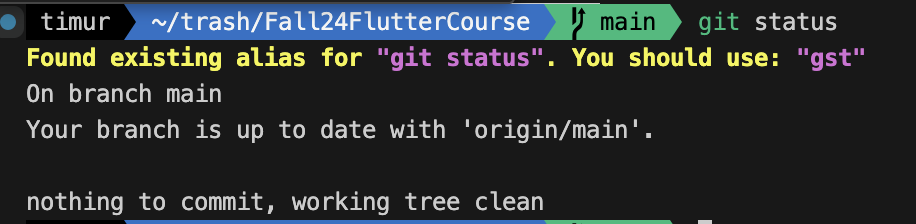

## 5. Pull new updates

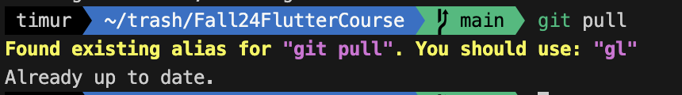

## 6. Create new branch for lab or project

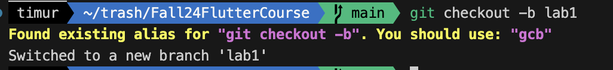

## 7. Complete lab or project

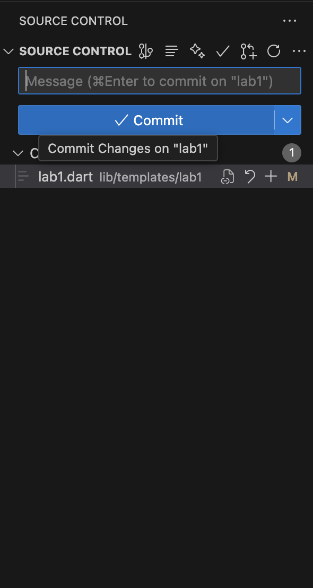

## 8. Add changes to your local index

`.` means add all recursively from current folders down

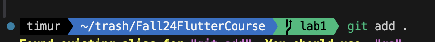

## 9. Commit all your changes from local index to local branch 

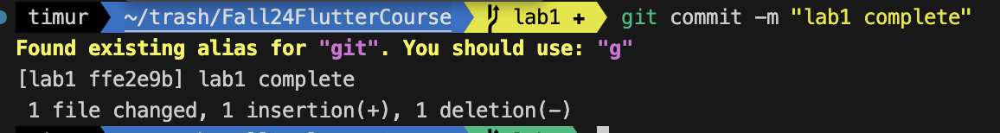

## 10. Push your changes to remote branch

If you push this branch first time - just copy suggestion and run this command

## 11. After successful push you should see your branch

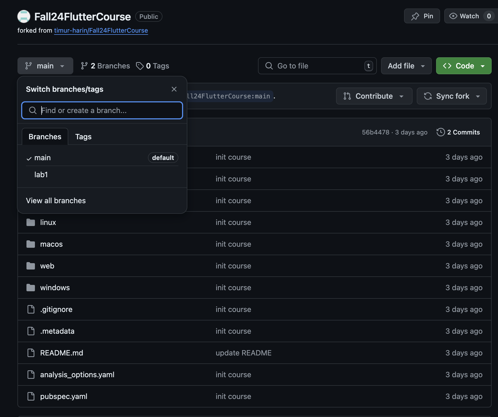

## 12. Go to your branch and create Pull Request

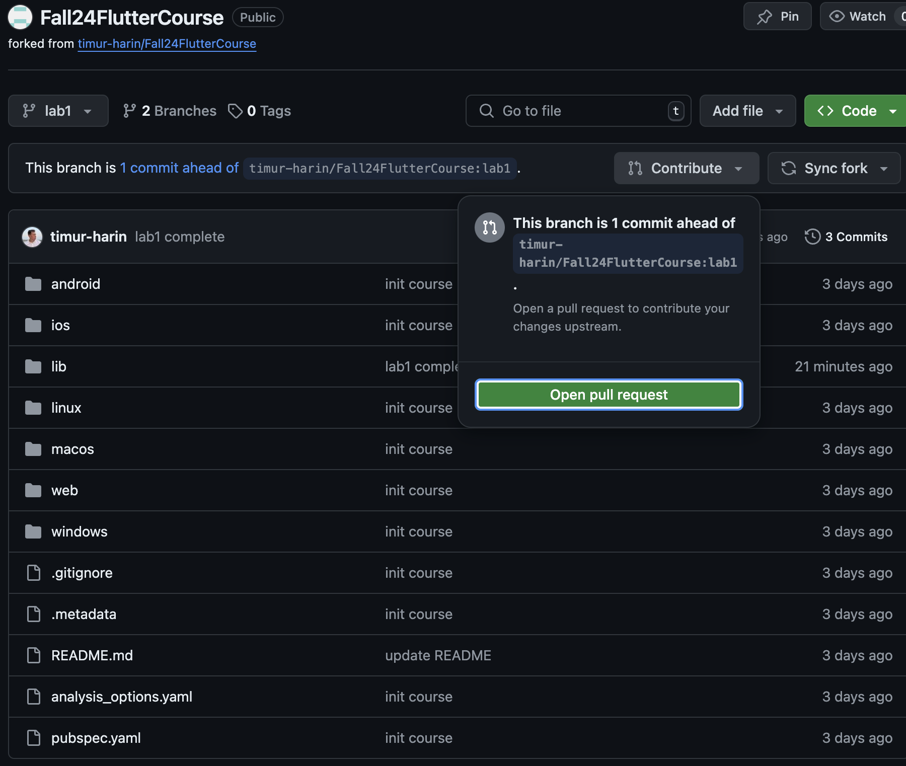

## 13. Check that you create pull request from your repo and needed branch to mine repo and main branch

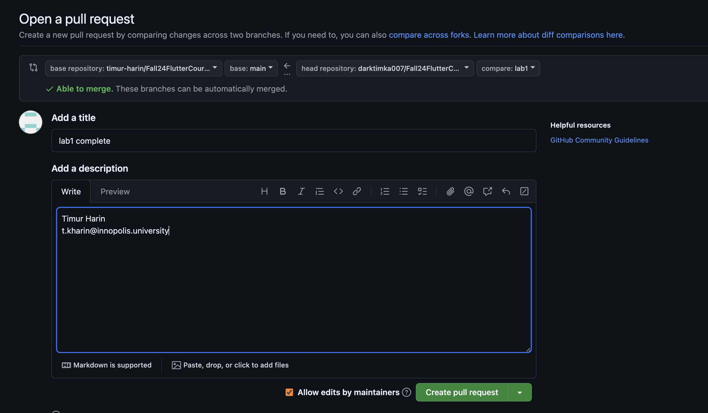

## 14. Copy link of your pull request and submit it on moodle

DO NOT CLOSE YOUR PULL REQUEST 

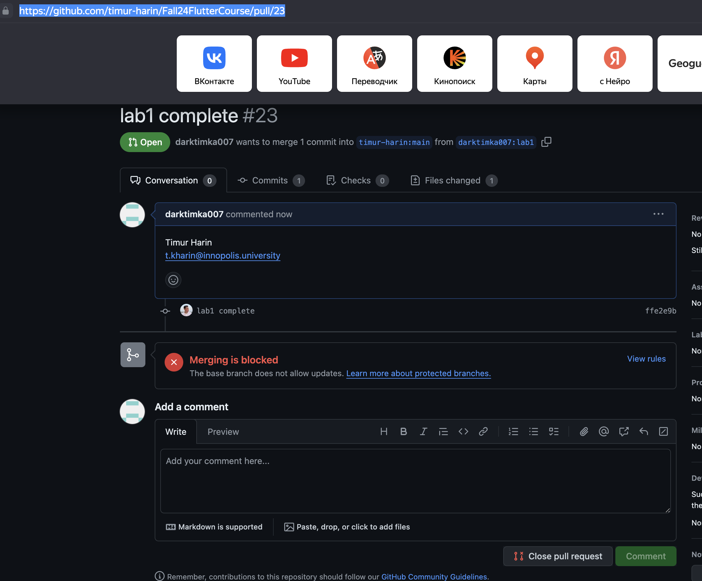

## 15. Submit on moodle

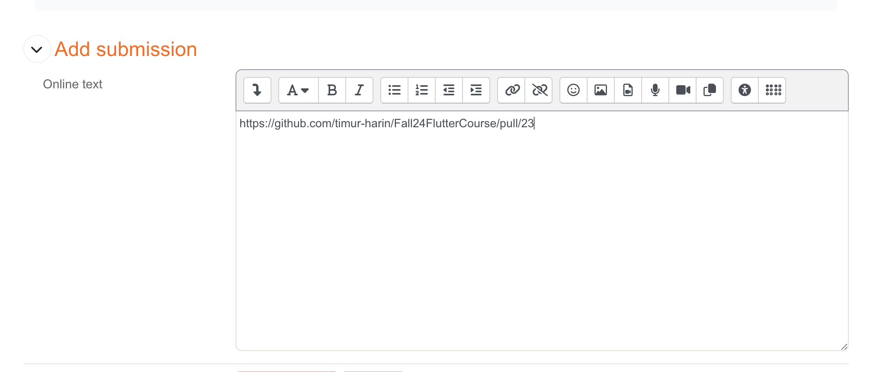
